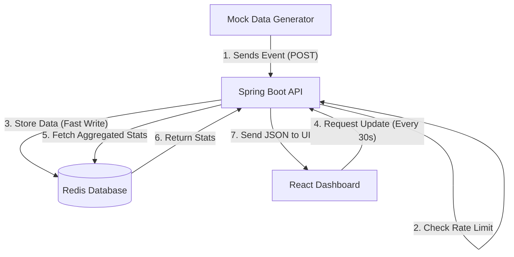

# Real-Time Analytics Platform

## Overview
A lightweight analytics service built with Spring Boot, Redis, and React. It ingests high-frequency user events, calculates rolling metrics in real-time, and displays them on a dashboard.


   

## Tech Stack
- **Backend**: Java 17, Spring Boot 3
- **Database**: Redis (Sorted Sets for time-series windows)
- **Frontend**: React (Vite)
- **Infrastructure**: Docker Compose

## Core Features
1. **Event Ingestion**: Handles JSON events with rate limiting (100 req/sec).
2. **Real-Time Metrics**:
   - Active Users (Rolling 5 min window)
   - Top Pages (Rolling 15 min window)
   - Active Sessions per User
3. **Mock Generator**: Built-in utility generating traffic for demo purposes.

## Setup Instructions

### Prerequisites
- Docker & Docker Compose installed.

### Running the App
1. Clone the repository.
2. Navigate to the root folder.
3. Run the following command:
   ```bash
   docker-compose up --build
